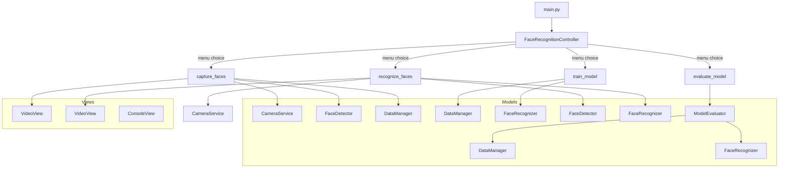
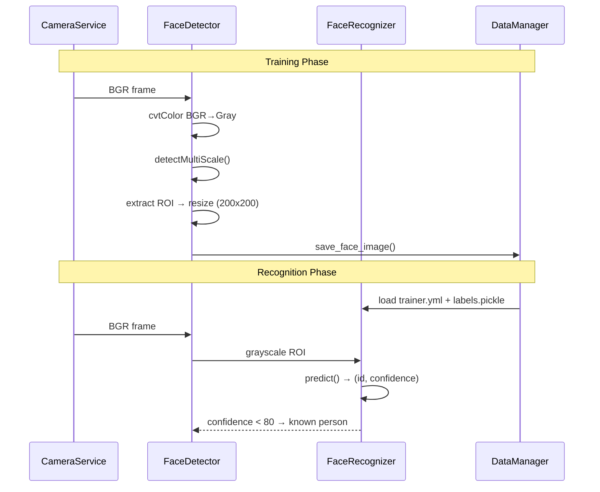

# Knowledge: Facial Recognition Lab — Entry Points & Architecture

## Tổng quan

Ứng dụng nhận diện khuôn mặt viết bằng Python, sử dụng OpenCV theo kiến trúc **MVC (Model-View-Controller)**. Pipeline bao gồm 4 luồng chính: thu thập ảnh, huấn luyện model, nhận diện realtime và đánh giá model.

- **Ngôn ngữ:** Python 3
- **Điểm vào chính:** `main.py` → `FaceRecognitionController.run()`
- **Thuật toán phát hiện:** Haar Cascade (frontal face)
- **Thuật toán nhận diện:** LBPH (Local Binary Patterns Histograms)
- **Giao diện:** Console menu (tiếng Việt) + OpenCV window

---

## Chi tiết Triển khai

### Điểm vào (Entry Points)

| File | Entry Point | Mô tả |
|------|------------|-------|
| `main.py:3` | `main()` | Khởi tạo controller và chạy vòng lặp chính |
| `src/controllers/face_recognition_controller.py:142` | `FaceRecognitionController.run()` | Menu-driven loop, điều phối toàn bộ flow |

### Các luồng thực thi chính

#### Luồng 1: Thu thập ảnh (`capture_faces`)
```
capture_faces(person_name) →
  CameraService (context manager) →
  Loop: read frame → grayscale →
    FaceDetector.detect_faces() →
    FaceDetector.extract_face_roi() →
    DataManager.save_face_image() →
    VideoView.draw/show →
  Exit on 'q' or sample count
```

#### Luồng 2: Train model (`train_model`)
```
train_model() →
  DataManager.load_training_data() → (faces[], labels[], label_map{})
  FaceRecognizer.train(faces, labels) →
  DataManager.save_model(model, label_map)
```

#### Luồng 3: Nhận diện realtime (`recognize_faces`)
```
recognize_faces() →
  DataManager.load_model_and_labels() →
  FaceRecognizer.load_model() →
  CameraService (context manager) →
  Loop: read frame → grayscale →
    FaceDetector.detect_faces() →
    FaceRecognizer.predict(roi) → (id, confidence) →
    is_confident(confidence)? → green/red rect + name/"Unknown"
  Exit on 'q'
```

#### Luồng 4: Đánh giá (`evaluate_model`)
```
evaluate_model() →
  ModelEvaluator(test_split=0.2) →
  evaluator.evaluate() →
    load_training_data() → split 80/20 →
    train LBPH trên train set →
    predict trên test set →
    tính accuracy, precision, recall, F1, confusion matrix
```

### Cấu trúc lớp và phụ thuộc

```
FaceRecognitionController
├── CameraService          (cv2.VideoCapture, context manager)
├── FaceDetector           (cv2.CascadeClassifier)
├── FaceRecognizer         (cv2.face.LBPHFaceRecognizer)
├── DataManager            (os, cv2, pickle)
├── ConsoleView            (static methods, Vietnamese UI)
├── VideoView              (static methods, cv2 display)
└── [lazy] ModelEvaluator  (DataManager + FaceRecognizer, sklearn optional)
```

### Config (các giá trị quan trọng)

| Hằng số | Giá trị | Ý nghĩa |
|---------|---------|---------|
| `DEFAULT_SAMPLES` | 30 | Số ảnh mặc định per person |
| `FACE_SIZE` | (200, 200) | Kích thước ROI chuẩn |
| `CONFIDENCE_THRESHOLD` | 80 | Ngưỡng nhận diện (thấp hơn = tốt hơn) |
| `DETECTION_SCALE_FACTOR` | 1.3 | Scale factor của Haar Cascade |
| `DETECTION_MIN_NEIGHBORS` | 5 | Min neighbors của Haar Cascade |
| `CAMERA_INDEX` | 0 | Index camera mặc định |

### Lưu trữ dữ liệu

```
dataset/
└── {person_name}/
    ├── {person_name}_0.jpg
    ├── {person_name}_1.jpg
    └── ...

trainer/
├── trainer.yml        # LBPH model (OpenCV YAML)
└── labels.pickle      # {name: id} mapping (Python pickle)
```

---

## Phụ thuộc

### External packages

| Package | Mục đích |
|---------|---------|
| `opencv-contrib-python` | Capture, detect, recognize, display (bao gồm cv2.face) |
| `numpy` | Array operations |
| `scikit-learn` | Metrics (optional — có fallback manual nếu thiếu) |

### Internal imports (depth 2)

```
main.py
└── FaceRecognitionController
    ├── CameraService ← Config
    ├── FaceDetector ← Config
    ├── FaceRecognizer ← Config
    ├── DataManager ← Config
    ├── ConsoleView (no imports)
    ├── VideoView (cv2 only)
    └── ModelEvaluator ← DataManager, FaceRecognizer, Config, sklearn?
```

---

## Sơ đồ Trực quan

### Kiến trúc MVC



### Pipeline xử lý ảnh



---

## Thông tin Bổ sung

### Xử lý lỗi
- Tất cả public methods trong controller dùng try-except, hiển thị lỗi qua `ConsoleView.show_error()`
- `FaceDetector._load_cascade()` raise `FileNotFoundError` nếu file XML không tồn tại
- `DataManager.load_model_and_labels()` raise `FileNotFoundError` nếu chưa có model được train
- `ModelEvaluator` có fallback manual cho tất cả sklearn metrics

### Hiệu năng
- LBPH không cần GPU, chạy tốt trên CPU thông thường
- Confidence threshold 80 (LBPH distance — thấp hơn = tốt hơn, ngược với probability)
- Mỗi người cần ≥1 ảnh trong dataset (default 30 ảnh)

### Rủi ro & Cải tiến tiềm năng
- **Rủi ro:** Haar Cascade nhạy cảm với ánh sáng, góc nghiêng > 45°
- **Rủi ro:** LBPH kém chính xác khi dataset nhỏ (< 20 ảnh/người)
- **Rủi ro:** Pickle deserialization từ file không tin cậy có thể gây RCE
- **Cải tiến:** Thêm deep learning face recognition (FaceNet, ArcFace)
- **Cải tiến:** Thêm data augmentation trong training pipeline

---

## Metadata

| Trường | Giá trị |
|--------|---------|
| Ngày phân tích | 2026-04-02 |
| Độ sâu phân tích | 3 cấp (main → controller → models) |
| Tổng số file Python | 13 |
| Ngôn ngữ | Python 3 |

**Các file liên quan:**
- [main.py](../../../main.py)
- [config.py](../../../config.py)
- [src/controllers/face_recognition_controller.py](../../../src/controllers/face_recognition_controller.py)
- [src/models/camera_service.py](../../../src/models/camera_service.py)
- [src/models/face_detector.py](../../../src/models/face_detector.py)
- [src/models/face_recognizer.py](../../../src/models/face_recognizer.py)
- [src/models/data_manager.py](../../../src/models/data_manager.py)
- [src/models/model_evaluator.py](../../../src/models/model_evaluator.py)
- [src/views/console_view.py](../../../src/views/console_view.py)

---

## Các Bước Tiếp theo

- [ ] Đọc sâu hơn `model_evaluator.py` — logic cross-validation và stratified split
- [ ] Kiểm tra `haarcascades/` — file XML có đúng version không
- [ ] Xem xét thay `pickle` bằng `json` hoặc `joblib` để an toàn hơn
- [ ] Thêm unit tests cho `FaceDetector` và `FaceRecognizer`
