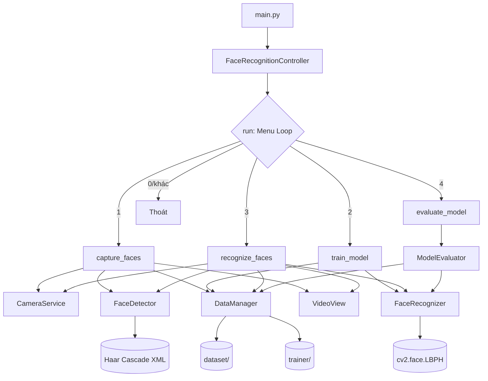
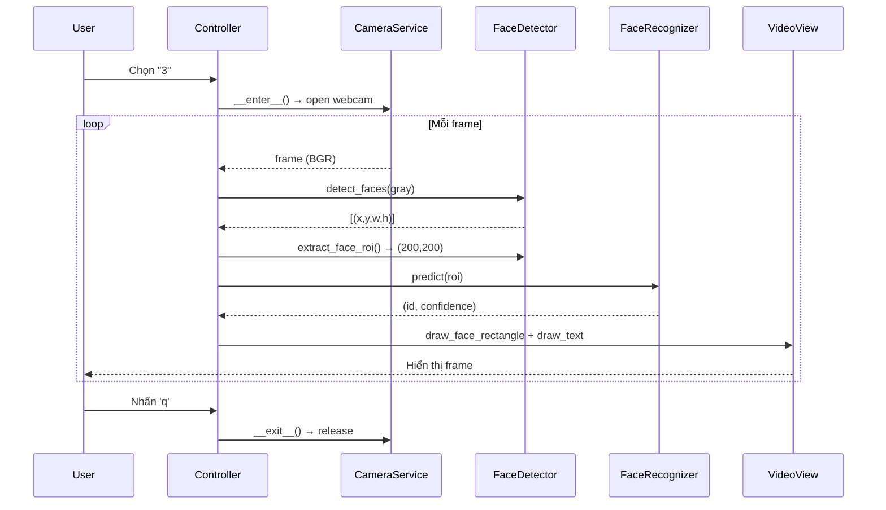

# Knowledge: main.py — Điểm Vào Ứng Dụng

## Tổng Quan

- **File:** `main.py` (8 dòng)
- **Ngôn ngữ:** Python 3.7+
- **Vai trò:** Khởi động ứng dụng nhận diện khuôn mặt thời gian thực
- **Hành vi cấp cao:** Khởi tạo `FaceRecognitionController` → gọi `run()` → vòng lặp menu tương tác vô hạn cho đến khi người dùng chọn thoát

```python
# Toàn bộ nội dung main.py
from src.controllers.face_recognition_controller import FaceRecognitionController

def main():
    controller = FaceRecognitionController()
    controller.run()

if __name__ == "__main__":
    main()
```

---

## Chi Tiết Triển Khai

### Luồng Thực Thi Chính (`run()`)

`FaceRecognitionController.run()` là vòng lặp sự kiện chính:

1. Gọi `Config.ensure_directories()` — tự động tạo `dataset/` và `trainer/` nếu chưa tồn tại
2. Hiển thị menu qua `ConsoleView.show_menu()`
3. Đọc lựa chọn từ stdin qua `ConsoleView.get_menu_choice()`
4. Dispatch đến 4 workflow dựa trên input (`"1"`, `"2"`, `"3"`, `"4"`)
5. Mọi lựa chọn khác → thoát vòng lặp

### Workflow 1: Thu Ảnh (`capture_faces`)

```
ConsoleView.get_person_name()
  → CameraService.__enter__()          # Mở cv2.VideoCapture(0)
    → loop:
        CameraService.read()           # Đọc frame BGR từ webcam
        cv2.cvtColor(BGR→GRAY)
        FaceDetector.detect_faces()    # Haar Cascade detectMultiScale
        FaceDetector.extract_face_roi()# Crop + resize → (200,200) grayscale
        DataManager.save_face_image()  # Ghi dataset/<name>/<name>_<i>.jpg
        VideoView.draw_face_rectangle()
        VideoView.show_frame()
        VideoView.wait_key()           # Thoát nếu 'q' hoặc đủ 30 ảnh
  → CameraService.__exit__()           # release() + destroyAllWindows()
ConsoleView.show_success()
```

**Điều kiện dừng:** Nhấn `q` HOẶC `count >= Config.DEFAULT_SAMPLES` (30)

### Workflow 2: Train Model (`train_model`)

```
DataManager.load_training_data()
  → os.walk(dataset/)
  → cv2.imread(GRAYSCALE) + cv2.resize(200,200) cho mỗi ảnh
  → trả về (faces: List[ndarray], labels: List[int], label_map: dict[str→int])

FaceRecognizer.train(faces, labels)
  → cv2.face.LBPHFaceRecognizer.train()
  → self._is_trained = True

DataManager.save_model(model, label_map)
  → model.save("trainer/trainer.yml")
  → pickle.dump(label_map, "trainer/labels.pickle")
```

**Lưu ý:** `train_model()` truy cập trực tiếp `self._face_recognizer._model` (private attribute) khi gọi `save_model()` — đây là coupling không lý tưởng.

### Workflow 3: Nhận Diện Thời Gian Thực (`recognize_faces`)

```
DataManager.load_model_and_labels()
  → pickle.load("trainer/labels.pickle")  → label_map
  → trả về (model_path, label_map)

FaceRecognizer.load_model(model_path)
  → self._model.read("trainer/trainer.yml")
  → self._is_trained = True

reverse_map = {v: k for k, v in label_map.items()}  # id→name

CameraService.__enter__()
  → loop:
      CameraService.read() → frame BGR
      FaceDetector.detect_faces(gray) → [(x,y,w,h), ...]
      FaceDetector.extract_face_roi() → (200,200) ndarray
      FaceRecognizer.predict(roi)
        → cv2.face.LBPHFaceRecognizer.predict() → (id, confidence)
      FaceRecognizer.is_confident(confidence)
        → confidence < Config.CONFIDENCE_THRESHOLD (80)
        → True  → color=(0,255,0) GREEN, name=reverse_map[id]
        → False → color=(0,0,255) RED,   name="Unknown"
      VideoView.draw_face_rectangle(frame, rect, color)
      VideoView.draw_text(frame, name, (x, y-10), color)
      VideoView.show_frame("Recognition", frame)
      VideoView.wait_key() == 'q' → break
CameraService.__exit__()
```

**Logic confidence:** LBPH trả về giá trị khoảng cách — **thấp hơn = tự tin hơn**. `< 80` → nhận diện được, `>= 80` → "Unknown".

### Workflow 4: Đánh Giá Model (`evaluate_model`)

```
ModelEvaluator(test_split=0.2)
  → DataManager.load_training_data() → (faces, labels, label_map)
  → ModelEvaluator.split_data()
      → nhóm theo label → shuffle ngẫu nhiên
      → 80% train, 20% test (stratified per person)
      → mỗi người tối thiểu 1 ảnh test
  → FaceRecognizer.train(train_faces, train_labels)
  → loop test set:
      FaceRecognizer.predict(face) → (id, confidence)
      confidence < threshold → predictions.append(id)
      confidence >= threshold → predictions.append(-1)  # Unknown
  → Tính metrics (sklearn nếu có, fallback thủ công):
      accuracy, precision, recall, f1_score (weighted)
      confusion_matrix
      per_person_accuracy
      confidence distribution (6 nhóm)
  → ModelEvaluator.print_report(results)
```

**Chú ý:** `ModelEvaluator` tạo `FaceRecognizer` mới riêng — **không** dùng model đã train sẵn trong `trainer/`. Mỗi lần đánh giá sẽ retrain từ đầu trên tập train.

---

## Phụ Thuộc

### Sơ Đồ Phụ Thuộc (Độ Sâu 3)

```
main.py
└── FaceRecognitionController          [src/controllers/face_recognition_controller.py]
    ├── config.Config                  [config.py]
    │   └── os (stdlib)
    ├── CameraService                  [src/models/camera_service.py]
    │   ├── cv2.VideoCapture           [opencv-contrib-python]
    │   └── config.Config
    ├── FaceDetector                   [src/models/face_detector.py]
    │   ├── cv2.CascadeClassifier      [opencv-contrib-python]
    │   │   └── haarcascades/haarcascade_frontalface_default.xml
    │   └── config.Config
    ├── FaceRecognizer                 [src/models/face_recognizer.py]
    │   ├── cv2.face.LBPHFaceRecognizer_create()  [opencv-contrib-python]
    │   ├── numpy                      [numpy]
    │   └── config.Config
    ├── DataManager                    [src/models/data_manager.py]
    │   ├── cv2.imread/imwrite/resize  [opencv-contrib-python]
    │   ├── pickle (stdlib)
    │   └── config.Config
    ├── ModelEvaluator (lazy import)   [src/models/model_evaluator.py]
    │   ├── DataManager                (xem trên)
    │   ├── FaceRecognizer             (xem trên)
    │   ├── sklearn.metrics            [scikit-learn] — tùy chọn
    │   └── numpy
    ├── ConsoleView                    [src/views/console_view.py]
    │   └── (không phụ thuộc ngoài)
    └── VideoView                      [src/views/console_view.py]
        └── cv2.imshow/rectangle/...   [opencv-contrib-python]
```

### Packages Ngoài

| Package | Phiên Bản | Bắt Buộc | Dùng Cho |
|---|---|---|---|
| `opencv-contrib-python` | bất kỳ | Có | Camera, detection, LBPH, hiển thị |
| `numpy` | bất kỳ | Có | Mảng ảnh, labels, tính toán metrics |
| `scikit-learn` | >=1.0.0 | Không | Metrics đánh giá (có fallback thủ công) |

### File Dữ Liệu Phụ Thuộc

| File | Tạo Bởi | Dùng Bởi |
|---|---|---|
| `dataset/<name>/<name>_<i>.jpg` | `capture_faces()` | `train_model()`, `evaluate_model()` |
| `trainer/trainer.yml` | `train_model()` | `recognize_faces()` |
| `trainer/labels.pickle` | `train_model()` | `recognize_faces()` |
| `haarcascades/haarcascade_frontalface_default.xml` | pre-built | `FaceDetector.__init__()` |

---

## Sơ Đồ Trực Quan

### Kiến Trúc Tổng Thể



### Luồng Dữ Liệu Nhận Diện



---

## Thông Tin Bổ Sung

### Xử Lý Lỗi

- Tất cả 4 workflow đều bọc trong `try/except Exception` tại `run()`
- Lỗi được in qua `ConsoleView.show_error()` và ứng dụng tiếp tục (không crash)
- `CameraService` dùng context manager (`with`) — đảm bảo camera luôn được `release()` dù có lỗi
- `FaceDetector.__init__()` raise `FileNotFoundError` ngay nếu cascade XML không tồn tại

### Rủi Ro & Lưu Ý

1. **Coupling private attribute:** `train_model()` gọi `self._face_recognizer._model` trực tiếp thay vì dùng `FaceRecognizer.save()` — vi phạm encapsulation nhẹ
2. **ModelEvaluator không dùng model đã lưu:** Mỗi lần evaluate sẽ retrain từ đầu, kết quả có thể khác model đang dùng để nhận diện thực tế
3. **Shuffle không seed:** `split_data()` dùng `np.random.permutation()` không có seed cố định — kết quả evaluate không tái lập được
4. **Lựa chọn "0" không được handle riêng:** Menu hiển thị `0. Thoát` nhưng code thoát với mọi input không phải 1/2/3/4 — bao gồm cả input rác

### Cải Tiến Tiềm Năng

- Thêm `FaceRecognizer.save(filepath)` thay vì truy cập `_model` trực tiếp trong controller
- Thêm `random_state` parameter vào `split_data()` để kết quả tái lập
- Handle riêng `"0"` và báo lỗi cho input không hợp lệ khác

---

## Metadata

| Trường | Giá Trị |
|---|---|
| Ngày phân tích | 2026-04-02 |
| Độ sâu phân tích | 3 lớp (toàn bộ chuỗi gọi) |
| Files đã đọc | `main.py`, `config.py`, `face_recognition_controller.py`, `camera_service.py`, `face_detector.py`, `face_recognizer.py`, `data_manager.py`, `model_evaluator.py`, `console_view.py` |
| Mục đích | Hiểu toàn bộ tính năng ứng dụng |

---

## Các Bước Tiếp Theo

Các khu vực liên quan có thể đào sâu hơn:

- **`/capture-knowledge` cho `ModelEvaluator`** — logic split/metrics khá phức tạp, đáng tài liệu hóa riêng
- **`docs/pipeline.md`** — so sánh với tài liệu pipeline hiện có để xác nhận độ chính xác
- **`/writing-test`** — bổ sung unit test cho `DataManager.load_training_data()` và `FaceRecognizer.predict()`
